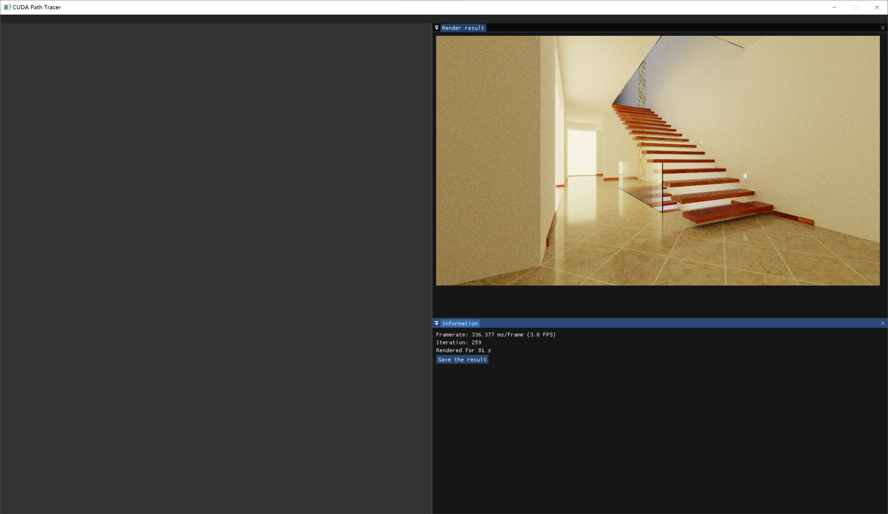
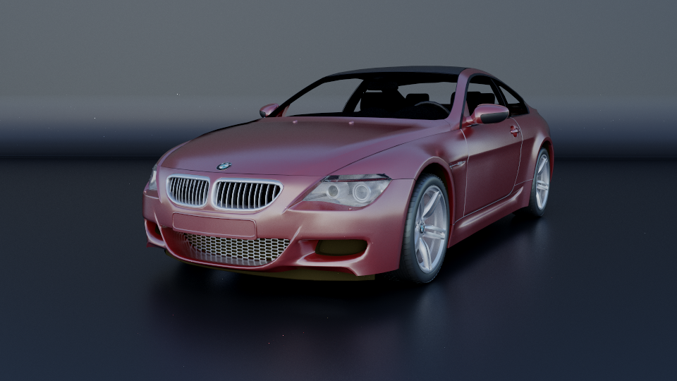
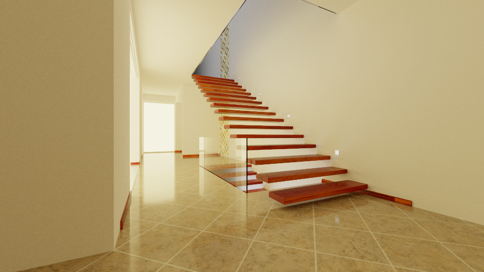
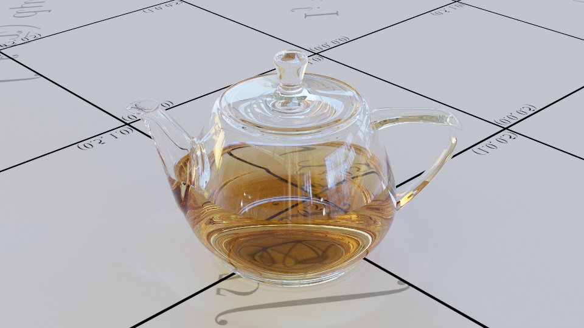

# Caster

CUDA-based physical renderer

## 1. Features

### shape

- Line
- Sphere
- Triangle

### Material

- Lambertian
- Mirror
- Dielectric
- Rough Conductor
- substrate

## 2. Dependencies

- CUDA 11.0
- DX11

## 3. Demo

## 4. Render result

